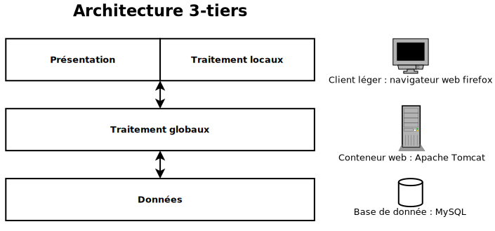
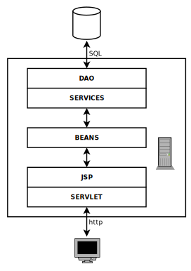

# Architecture général de vitameal

## Une architecture 3-tiers

Vitameal est basé sur une architecture 3-tiers : 
* le premier niveau correspond à la présentation et au traitement locaux, c'est à dire l'interface graphique et du transfert d'information par formulaire utilisant le protocole `http` pour communiquer avec le deuxième niveau ;
* le deuxième niveau correspond au traitement globaux, c'est à dire le traitement des données par des composants ;
* le troisième niveau correspond aux données, c'est à dire le stockage des données dans une SGBD

## Détails

## Lien utile

[Cour OpenClassroom - Créez votre application web avec Java EE](https://openclassrooms.com/courses/creez-votre-application-web-avec-java-ee?status=published)