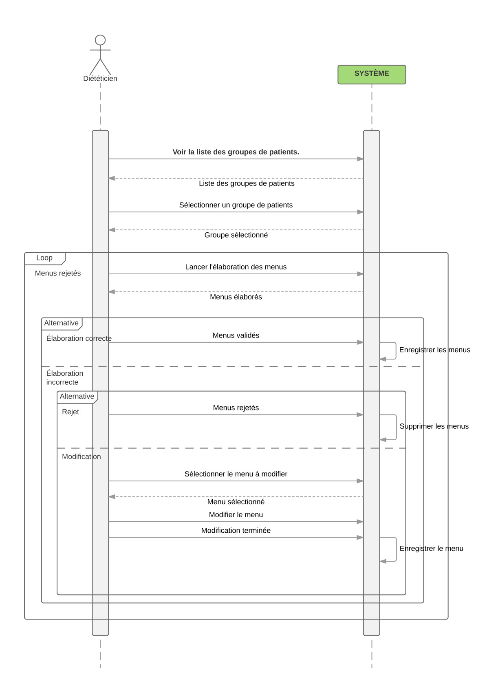

### Élaboration des menus

* **Nom:** Élaboration des menus (Figure \[MenuGenCU\]).
* **ID:** UC300
* **Description:** Permet l’élaboration des menus.
* **Auteur:** Jean-Félix BENITEZ.
* **Date:** 15/06/2017
* **Acteurs:** Diététiciens.
* **Pré-Conditions:** Le diététicien s’est connecté au système.
* **Scénario principal:**
    1.  Le diététicien sélectionne le groupe de patients pour lequel il
        veut générer les menus,  
    2.  ensuite il lance l’élaboration des menus.  
    3.  L’élaboration automatique ce déroule en prenant en compte les
        grammages.  
    4.  Lorsque les menus sont élaborés, s’il estime l’élaboration
        correcte, il la valide.  
    5.  S’il estime l’élaboration incorrecte, il peut la rejeter, auquel
        cas il reviens à l’étape 2 
    6.  S’il estime l’élaboration incorrecte, il peut aussi la modifier
        manuellement.  
* **Scénario alternatif:** Aucun.
* **Post-Conditions:** Les menus sont générés.

