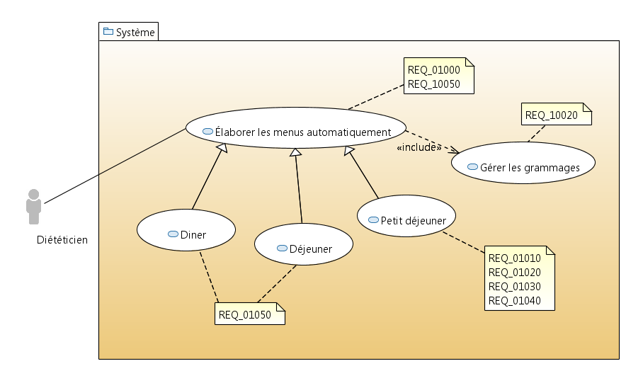
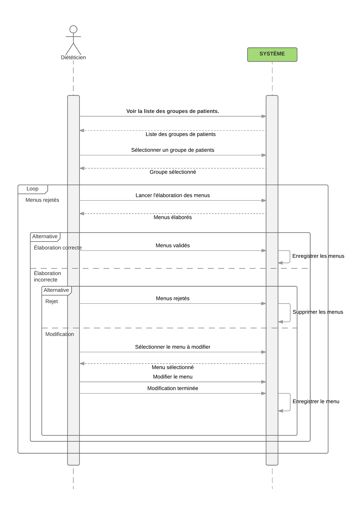
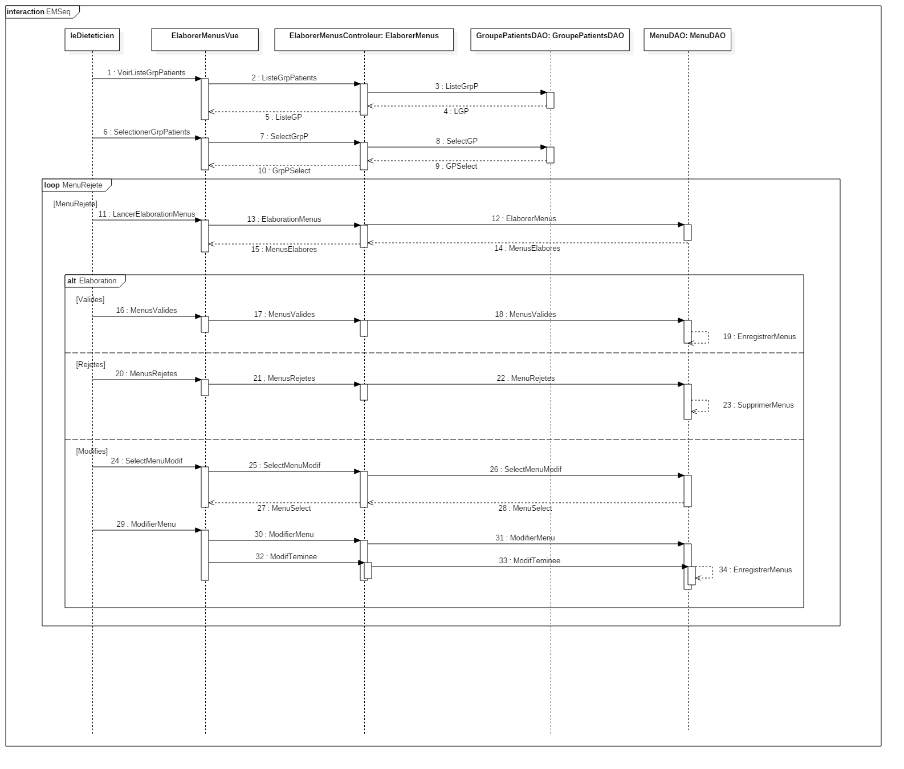
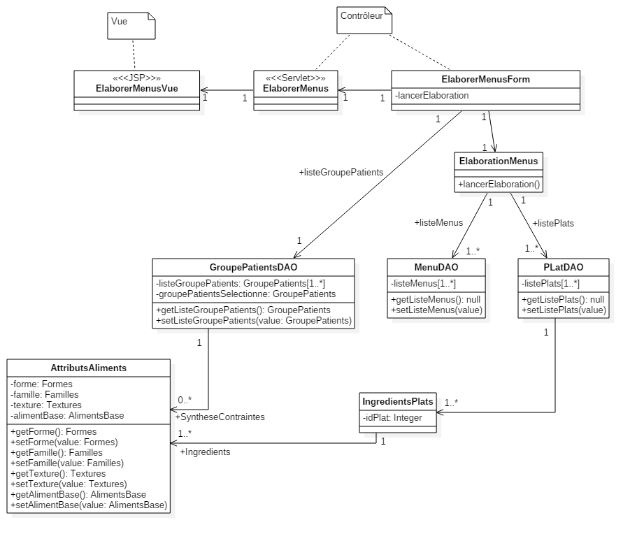

### Élaboration des menus

Nom: Élaboration des menus ().  
ID: UC300  
Description: Permet l’élaboration des menus.  
Auteur: Jean-Félix BENITEZ.  
Date: 15/06/2017  
Acteurs: Diététiciens.  
Pré-Conditions: Le diététicien s’est connecté au système.  
Scénario principal: et  
    1.  Le diététicien sélectionne le groupe de patients pour lequel il
        veut générer les menus,  
    2.  ensuite il lance l’élaboration des menus.  
    3.  L’élaboration automatique ce déroule en prenant en compte les
        grammages.  
    4.  Lorsque les menus sont élaborés, s’il estime l’élaboration
        correcte, il la valide.  
    5.  S’il estime l’élaboration incorrecte, il peut la rejeter, auquel
        cas il reviens à l’étape 2  
    6.  S’il estime l’élaboration incorrecte, il peut aussi la modifier
        manuellement.  
Scénario alternatif: Aucun.  
Post-Conditions: Les menus sont générés.  

**Algorithme:**
1.  Sélectionner le groupe de patient dont il faut élaborer les menus  
2.  Extraire de ce groupe de patients les contraintes sous forme d’une
    table d’*AttributAliment* (voir ).  
3.  Générer une table contenant en plus des identifiants de plats la
    liste de leurs ingrédients, sous forme d’*AttributAliment*.  
4.  Retirer de cette table, les plats incompatibles avec les contraintes
    listées dans la première table.  
5.  En comparant la table de plats résultante avec les menus déjà pris,
    extraire de la liste des plats (première table) les plats
    compatibles avec les fréquences de services.  
6.  élaborer les menus à partir de la liste des plats restants.  

